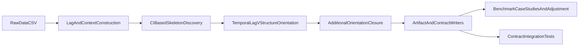

# CD-NOTS Reproduction Master Plan (Deep Version)

## Why This Document Exists

This is the governing technical plan for turning the repository into a scientifically
defensible, reproducible, and maintainable implementation of CD-NOTS-style causal
discovery workflows. It is intentionally explicit about:

- paper-level intent and assumptions,
- exact implementation status per component,
- what is faithfully reproduced vs approximated,
- acceptance criteria for future milestones.

---

## 1) Problem Framing and Scientific Goal

The paper addresses causal structure learning under nonstationary time series with
lagged dependencies and potentially nonlinear interactions. The practical challenge
is that most off-the-shelf constraint-based methods degrade when:

- stationarity assumptions break,
- context shifts across time/regimes/entities,
- lag structure is ignored or weakly encoded,
- CI testing has finite-sample instability.

The repository therefore needs to support two linked goals:

1. **Structure discovery quality** (adjacency and directionality behavior under lag/context),
2. **Downstream estimand transparency** (how discovered structure informs adjustment choices).

---

## 2) Conceptual Pipeline (Target End State)

Interpretation:

- `lagContext` corresponds to model input construction.
- `skeleton` and `orientation` are the scientific core.
- `artifacts` forms the reproducibility boundary.
- `downstream` includes benchmark and graph-guided regressions.

---

## 3) Fidelity Matrix: Paper Intent vs Current Implementation

| Paper-Level Capability | Current Status | Where Implemented | Fidelity |
|---|---|---|---|
| Lag-augmented variable construction | Implemented | `src/cdnots/utils.py` | Medium-High |
| Context variable support | Implemented (time index/country code) | `discovery2/services.py` | Medium |
| CI abstraction for multiple methods | Implemented as interface | `src/cdnots/ci_tests.py` | Medium |
| Method-specific CI internals (KCIT/RCoT/CMIknn) | Not fully implemented (fallback to ParCorr) | `src/cdnots/ci_tests.py` | Low |
| Skeleton pruning by CI conditioning sets | Implemented | `src/cdnots/stages.py` | Medium |
| Stage-3 orientation (temporal, lag, v-structures) | Implemented | `src/cdnots/stages.py` + `src/cdnots/orientation.py` | Medium |
| Stage-4 orientation (module-change style) | Approximate Meek-like closure | `src/cdnots/stages.py` | Low-Medium |
| CD-NOD workflow with persisted directed/undirected artifacts | Implemented | `discovery2/services.py`, `discovery2/io_utils.py` | High (engineering), Medium (scientific interpretation) |
| Simulation and benchmark runners | Implemented | `experiments/run_simulations.py`, `experiments/run_benchmark_pcmci.py` | Medium |
| Graph-guided adjustment workflow | Implemented as explicit heuristic | `experiments/class_oriented_graph_adjustment.py` | Medium |

---

## 4) Architecture Status (What Has Been Engineered)

### 4.1 Core package (`src/cdnots`)

- `models.py`: typed config/result objects.
- `stages.py`: decomposed skeleton and orientation stage logic.
- `core.py`: orchestrator exposing both:
  - `fit()` for legacy dict-compatible consumers,
  - `fit_result()` for typed use.
- `project_io.py`: shared path/logging infrastructure.

Design quality improved via explicit service boundaries and typed result contracts.

### 4.2 Discovery pipeline (`discovery2`)

- `services.py` consolidates preprocessing + CD-NOD execution + artifact packaging model.
- `graph_decode.py` and `io_utils.py` contain decode and persistence/render concerns.
- `run_causal_learn.py` is now a thin CLI coordinator.

This reduces orchestration sprawl and makes contract behavior easier to test.

### 4.3 Experiment and script layer

- Shared helper module: `experiments/common.py`.
- Runners depend on shared path/load helpers to reduce repeated file and schema logic.

---

## 5) Current Testing Posture (Detailed)

### Existing automated coverage

- Core API compatibility:
  - `tests/test_cdnots_core.py`
- Stage behavior:
  - `tests/test_cdnots_stages.py`
- CI stability and fallback behavior:
  - `tests/test_ci_tester.py`
- Discovery decode contracts:
  - `tests/test_discovery_contracts.py`
  - `tests/test_graph_decode.py`
- Discovery services (preprocess + row-threshold guard):
  - `tests/test_discovery_services.py`
- CLI orchestration behavior (mocked):
  - `tests/test_run_causal_learn_cli.py`
- Experiment helper contracts:
  - `tests/test_experiments_common.py`

### Coverage limitations still present

- No full non-mocked end-to-end discovery test over real inputs.
- No regression test asserting numerical parity against a fixed baseline snapshot.
- No benchmark drift detection gate (e.g., tolerance thresholds for summary metrics).

---

## 6) High-Risk Gaps (Scientific + Engineering)

1. **CI-method fidelity risk**
   - Non-ParCorr methods are currently semantic aliases with fallback behavior.
   - Risk: users infer method diversity that is not yet algorithmically realized.

2. **Orientation fidelity risk**
   - Stage-4 is approximate, not module-change faithful.
   - Risk: directionality conclusions may diverge from paper behavior.

3. **Interpretability risk in graph-guided adjustment**
   - Directed subgraph parents(Z) heuristic can be brittle under PDAG ambiguity.
   - Risk: over-interpretation of estimated coefficients as robust causal effects.

4. **Reproducibility drift risk**
   - External data providers and dependency updates can change results over time.
   - Risk: inconsistent artifacts across machines/dates.

---

## 7) Deep Implementation Roadmap

### Phase A: Fidelity-critical algorithmic work

#### A1. CI backend parity
- Implement distinct computational pathways for:
  - `kcit*`, `rcot*`, `cmiknn`.
- Add method-level tests:
  - correct method labeling,
  - finite outputs under edge cases,
  - deterministic behavior under seeded settings.

**Acceptance criteria**
- No fallback labels in standard runs for these methods.
- Method-specific tests pass with non-trivial data.

#### A2. Stage-4 orientation parity
- Replace approximate closure with a paper-faithful orientation module (or explicitly
  versioned variant if exact parity is mathematically infeasible).

**Acceptance criteria**
- Orientation unit tests derived from canonical motif examples.
- Documented rule mapping from paper to implementation.

### Phase B: Validation and reproducibility hardening

#### B1. Contract + integration test expansion
- Add end-to-end tests for:
  - `run_simulations.py --quick`
  - `run_causal_learn.py --dataset famafrench --max-rows N`
  - one macro case and one benchmark path.
- Assert required artifact files and schema columns.

#### B2. Baseline snapshot suite
- Maintain a small pinned input slice and expected outputs with tolerances.

**Acceptance criteria**
- CI fails on schema regressions or unexpected large metric drift.

### Phase C: Performance and operational maturity

#### C1. Profiling-guided optimization
- Profile skeleton-stage conditioning loops and graph transforms.
- Optimize only proven hotspots.

#### C2. Runtime modes and ergonomics
- Standardize quick/full profiles across all heavy workflows.
- Add consistent CLI verbosity/logging options.

**Acceptance criteria**
- Quick mode completes within explicit target budget on reference hardware.

### Phase D: Publication-quality documentation

#### D1. Reader-facing fidelity guide
- Add one table in `README.md`: feature, status, caveat.

#### D2. Method caveats and usage guidance
- Add explicit warnings where outputs are heuristic.

**Acceptance criteria**
- New users can identify approximation boundaries without code inspection.

---

## 8) Implementation Governance Rules

- Preserve public file-output contracts unless intentionally versioned.
- Keep `fit()` backward-compatible while typed APIs evolve.
- Require tests for every behavior change in:
  - CI dispatch,
  - orientation rules,
  - artifact schema.
- Mark scientific approximations explicitly in docstrings and docs.

---

## 9) Milestone Checklist

### Milestone M1 (Completed)
- [x] Architectural decomposition and modular service boundaries.
- [x] Initial contract tests and shared helper consolidation.

### Milestone M2 (In progress)
- [ ] CI backend parity beyond fallback behavior.
- [ ] Stage-4 orientation fidelity upgrade.
- [ ] Integration artifact-golden tests.

### Milestone M3 (Planned)
- [ ] Performance profile and optimization pass.
- [ ] Publication-grade reproducibility and fidelity documentation.

---

## 10) Definition of Done (Strict)

Project is considered complete only when all are true:

1. Core algorithmic stages are either paper-faithful or explicitly versioned with
   validated deviations.
2. CI methods advertised in config correspond to real method-specific computations.
3. End-to-end workflows pass contract/integration tests on fresh environment setup.
4. Artifact outputs are reproducible under pinned dependencies and seeded runs.
5. Documentation clearly distinguishes:
   - implemented exactly,
   - implemented approximately,
   - intentionally out-of-scope.
